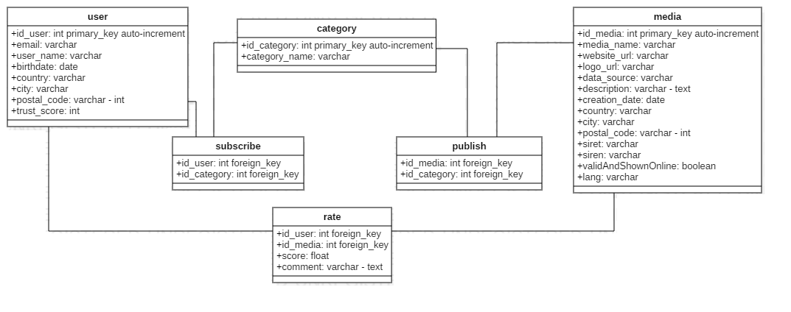
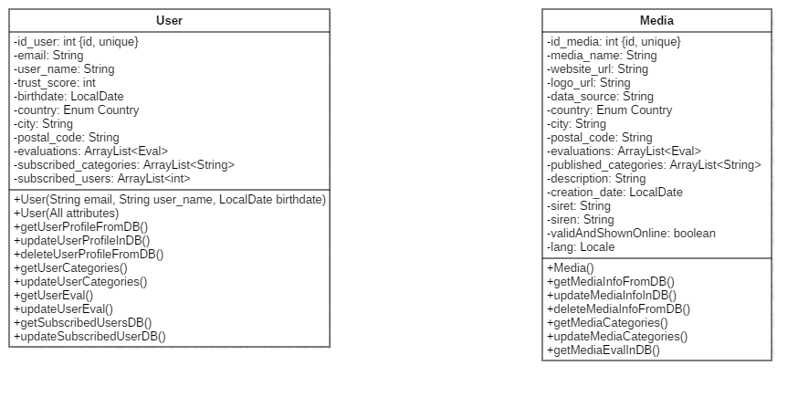

# MediaAdvisor

## Description

MediaAdvisor est un projet visant à donner à ses utilisateurs un moyen de s'exprimer vis-à-vis de la qualité et de la crédibilité des médias qu'ils ont pu utilisés.
Dans un second temps, le système de notation permettra aux utilisateurs de s'orienter vers des médias de qualité, en fonction de leur pays et de leur sujet favoris.

[Source de l'idée du projet.](https://twitter.com/elonmusk/status/999374720368689153?lang=en)

> Projet de mise en pratique des compétences acquises en POEI.

## Sommaire

- [Features](#features)
- [Maquettes](#maquettes)
- [Documentation](#documentation-provisoire)
- [Technologies utilisées](#technologies-utilisées)
- [How To](#how-to)

## Features (may change) ~

1. Etape **BASE**
	- *INSCRIPTION* User (user)
	- *INSCRIPTION* Editeur (media)
	- *AJOUT* d'un MEDIA (media)
	- *MODIFICATION* d'un media (media)
	- *RECHERCHER* d'un media (media & user)

2. Etape **NOTATION** (user) [voir ajout d'un commentaire en + de la note]
	- *NOTER* un media [un article à la fois si PRESSE, une émission au globale si CHAÎNE D'INFO]
	- *REVOIR* SES NOTES
	- *CHANGER* SES NOTES
	- *ETRE NOTIFIER* quand les notes sont remises à ZERO

3. Etape **NEXT**
	- *REMONTER* des informations évaluées par TLM sur PAGE D'ACCUEIL (STARRING MAX CRED) (article ou émission)

4. Etape **BONUS**
	- Système de récompense pour utiisateurs assidus (système d'abonnement entre utilisateurs, titres: ex. "débutant / "expert", badges)
	- Système d'abonnement entre utilisateurs
	- *API* pour sites tiers : noter les articles/émissions directement sur leur support propriétaire (media)

## Maquettes

### Maquettes fonctionnelles & Design (Wireframe, pour le layout)

#### Vues

- Accueil (+ suggestions)
	- Mettre en place un prompt pour l'inscription (popup d'une fois ou bloc fixe sur le côté)
	- Ajouter les réseaux sociaux
	- Image en fond avec une barre de recherche décalée (entre menu de navigation et premiers éléments de la page)
	- Rajouter du contenu de chaque côté du contenu principal (filtres de recherche, user reviews, abonnement utilisateurs)
	

- Accueil Menu

- Inscription User

- Inscription Media

- Media Search

- Carte Media

#### Outils & Inspiration

- [Balsamiq](https://balsamiq.com)

- [Examples Medium](https://medium.muz.li/cool-ideas-of-mobile-ui-inspiration-2a4c11a818d2)
- [Examples WebDesign Inspiration](https://www.webdesign-inspiration.com/web-designs/type/mobile-app)

### Palette & Charte graphique

## Documentation provisoire

### Diagramme de cas d'utilisation

### Dictionnaire de données ([lien vers le PDF](Docs/Dictionnaire_de_données.pdf))

### Model Conceptuel de Données

### Diagramme de classe

### Diagramme de séquence (waiting for backend)

## Technologies utilisées ~

### Front End ~

- HTML
- CSS
- Sass
- Javascript
- Angular (Version 7.0.4 Stable)
- Material / Bootstrap
- Ionic / NativeScript

### Back End ~

- JEE
- JUnit
- NodeJs (Version 10.13.0 LTS)
- Maven
- GitHub
- TomCat
- Spring
- ODBC 
- API REST

## How To

### Install & Use prerequisites

#### From the ground up

- [NodeJs, Angular, Git PDF](Docs/Pre-requis.pdf)
- [Git Bash / GitHub Quickstart Guide](Docs/git.pdf) 

#### From git

- Angular & co : once you downloaded the `angular-setup` branch, go in the directory in which you'll find angular (with several jsons such as angular.json & package.json), open the windows prompt in it (or *navigate to it with the console : cd, etc...* `windows button + r : type 'cmd'`) and type `npm install`.
To test if it's working properly, once the download / installation from npm is complete, type `ng serve` in the same prompt and same directory. You should see the web page open itself and if it's not the case open [http://localhost:4200/](http://localhost:4200/).

- API REST : download the `api-rest` branch and import it with your java IDE as a **Maven Project**, right click on the project and select `Maven > update project`. If you want to test it you might want to download a chrome extension such as ARC or Restlet Client. To actually test it, just type or copy [localhost:8095/rest/user/all](http://localhost:8095/rest/user/all) in your **GET** field.

### Deploy

- Development Release (MVP)

- Production Release (MMP)

## Team

- Leonore
- Juliette
- Guillaume
- Pierre
- Jean

## POE

[Lien vers le projet de l'autre équipe (à compléter)](Docs/Pre-requis.pdf)
